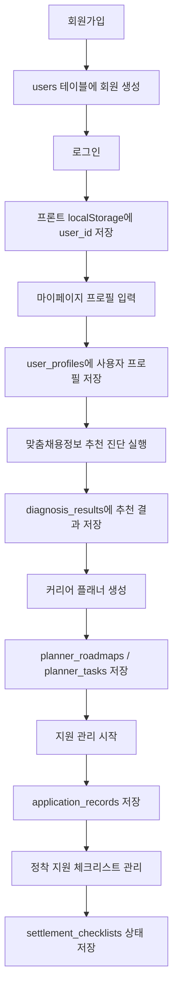
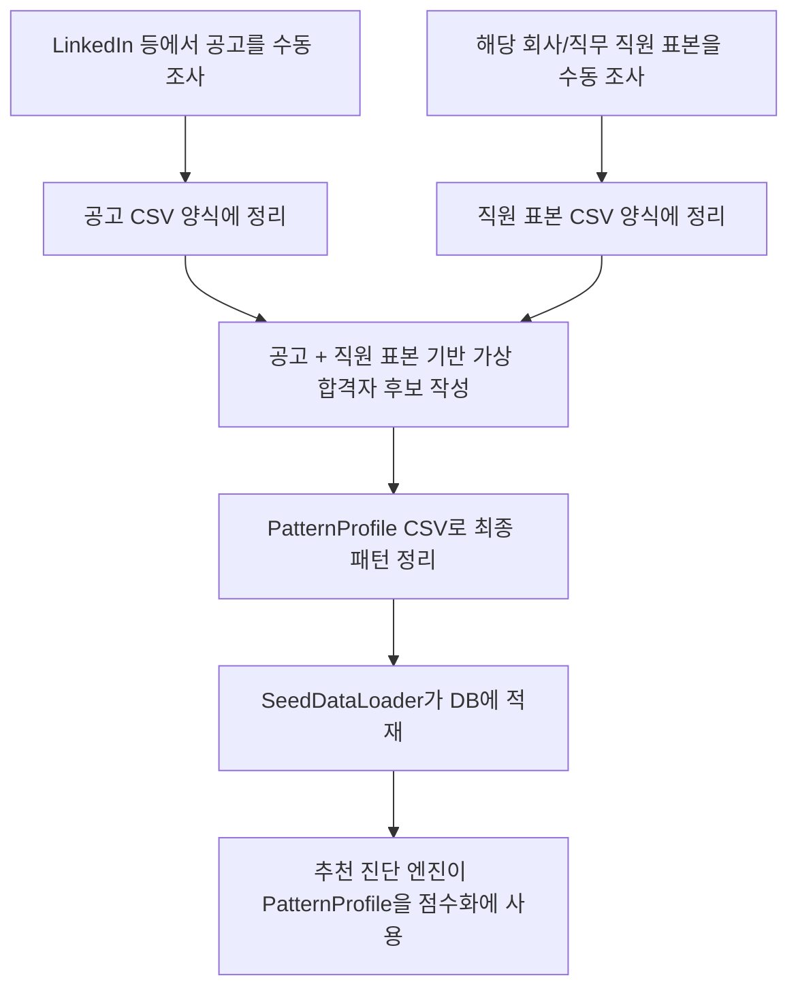

# CareerLens 사용자별 데이터 저장 흐름과 시연 시나리오

이 문서는 CareerLens가 현재 프로토타입 기준으로 사용자별 데이터를 어떻게 저장하고 다시 불러오는지 설명한다.
조원들이 회원가입, 로그인, 프로필 입력, 추천 진단, 플래너, 지원 관리, 정착 지원 흐름을 같은 기준으로 이해하기 위한 문서다.

## 1. 현재 결론

현재 구조는 사용자별 저장 구조로 잡혀 있다.

1. 사용자가 회원가입을 하면 `users` 테이블에 회원이 생성된다.
2. `users.id`는 DB에서 자동 증가하는 기본키다.
3. 로그인 성공 시 백엔드는 `user_id`, `login_id`, `display_name`, `email`, `profile_completed`를 프론트에 내려준다.
4. 프론트는 이 로그인 사용자 정보를 `localStorage`의 `careerlens_user` 키에 저장한다.
5. 이후 프로필, 추천 진단, 플래너, 지원 관리, 정착 지원 API는 이 `user_id`를 기준으로 호출된다.
6. 다시 로그인하면 같은 회원의 `user_id`가 내려오므로, 이전에 저장한 사용자별 데이터를 다시 불러올 수 있다.

즉, 현재는 임의 사용자 하나에만 저장하는 구조가 아니라 회원별로 분리해서 저장하는 구조다.

## 1-1. 시연용 기본 계정

백엔드 실행 시 seed 데이터 로더가 시연용 기본 계정을 보장한다.

| 항목 | 값 |
| --- | --- |
| 로그인 ID | `demo` |
| 이메일 | `demo@careerlens.local` |
| 비밀번호 | `CareerLens123!` |
| 기본 프로필 | 미국 / Backend / 3년차 / 영어 Business / Java, Spring Boot, MySQL |

이 계정은 발표 당일 DB를 새로 만들었거나 조원이 처음 실행한 환경에서도 바로 로그인해서 전체 흐름을 시연하기 위한 계정이다.

주의:

- 이미 `demo` 계정이 존재하고 비밀번호가 설정되어 있으면 seed loader가 기존 비밀번호를 덮어쓰지 않는다.
- 처음 생성되는 경우에만 위 기본 비밀번호가 적용된다.
- 일반 사용자는 기존처럼 회원가입을 통해 별도 계정을 만들 수 있다.

## 2. 현재 인증 방식

현재는 캡스톤 시연용 단순 인증 구조다.

- 회원가입: `POST /api/auth/signup`
- 로그인: `POST /api/auth/login`
- 프론트 저장 위치: `localStorage.careerlens_user`
- 저장 정보: `user_id`, `login_id`, `display_name`, `email`, `profile_completed`

주의할 점:

- 아직 JWT, Spring Security 세션, refresh token 구조는 아니다.
- API 요청은 로그인한 사용자의 `user_id`를 경로에 넣어서 호출한다.
- 발표에서는 “현재는 시연용 localStorage 기반 로그인이고, 이후 실제 서비스화 단계에서 JWT/Spring Security로 강화한다”고 설명하면 된다.

## 3. 테이블별 사용자 연결 구조

| 기능 | 주요 테이블 | 사용자 연결 기준 | 설명 |
| --- | --- | --- | --- |
| 회원가입/로그인 | `users` | `users.id` | 회원의 기본 ID가 자동 증가로 생성된다. |
| 해외취업 프로필 | `user_profiles` | `user_id` | 마이페이지에서 입력한 프로필이 사용자별로 저장된다. |
| 추천 진단 결과 | `diagnosis_results` | `user_id` | 추천 진단을 실행하면 사용자별 진단 결과가 저장된다. |
| 커리어 플래너 | `planner_roadmaps` | `user_id` | 추천 결과에서 생성한 로드맵이 사용자별로 저장된다. |
| 플래너 과제 | `planner_tasks` | `roadmap_id` | 로드맵에 속한 주차별 과제와 상태가 저장된다. |
| 지원 관리 | `application_records` | `user_id` | 플래너에서 지원 관리로 넘긴 공고가 사용자별로 저장된다. |
| 정착 지원 | `settlement_checklists` | `user_id` | 첫 조회 시 사용자별 미국/일본 체크리스트가 생성되고 상태가 저장된다. |

## 4. 사용자 기준 실제 흐름

## 5. 관리자/데이터 입력 기준 흐름

현재 프로젝트에서 공고/직원 표본/패턴 데이터는 외부 API나 자동 수집이 아니라 수동 조사 기반 seed-data로 관리한다.

중요:

- 자동 크롤링, LinkedIn scraping, 외부 ATS/API 연동은 현재 단계에서 하지 않는다.
- AI는 공고/직원 표본을 바탕으로 “가상 합격자 후보와 PatternProfile 초안 작성”을 돕는 도구로 사용할 수 있다.
- 최종 DB 반영은 관리자가 CSV를 검수하고 seed-data로 넣는 방식이 안전하다.

## 6. 추천 진단 실행 시 비교 대상

추천 진단은 단순히 사용자와 공고만 비교하지 않는다.

현재 의도한 비교 구조:

1. 사용자 프로필을 불러온다.
2. 국가, 직무군, 언어, 경력 기준으로 공고를 1차 필터링한다.
3. 공고별로 연결된 PatternProfile을 불러온다.
4. 사용자 프로필과 PatternProfile을 비교한다.
5. 공고별 가중치와 사용자 우선순위를 반영한다.
6. 추천 결과, 부족 요소, 준비도, 다음 액션을 생성한다.

PatternProfile은 공고와 직원 표본, 가상 합격자 후보를 사람이 정리해서 만든 “공고별 직무 합격자 패턴 요약 데이터”다.

## 7. 발표용 시연 순서

중간발표에서 가장 안정적인 시연 흐름은 아래 순서다.

### 안정 시연 루트

1. 메인 페이지에서 CareerLens가 어떤 서비스인지 설명한다.
2. `demo / CareerLens123!` 계정으로 로그인한다.
3. 마이페이지에서 기본 프로필이 불러와지는지 확인한다.
4. 필요하면 기술스택이나 우선순위를 살짝 수정하고 저장한다.
5. 맞춤채용정보 추천 진단을 실행한다.
6. 추천 결과 카드에서 점수, 부족 요소, PatternProfile 근거를 설명한다.
7. 커리어 플래너를 생성한다.
8. 플래너 상세에서 주차별 과제 상태를 변경한다.
9. 지원 관리 시작 버튼을 누른다.
10. 지원 관리 페이지에서 공고가 파이프라인에 생성된 것을 확인하고 상태를 변경한다.
11. 정착 지원 페이지에서 국가별 체크리스트 상태를 변경한다.
12. 새로고침 또는 재로그인 후 사용자별 데이터가 유지되는 것을 설명한다.

### 회원가입 흐름 시연 루트

1. 새 계정으로 회원가입한다.
2. 로그인 후 마이페이지에서 프로필을 직접 입력한다.
3. 추천 진단을 실행해 새 사용자 기준 결과가 달라지는 것을 설명한다.
4. 이후 플래너, 지원 관리, 정착 지원은 안정 시연 루트와 동일하게 진행한다.

발표 시간이 짧으면 안정 시연 루트를 먼저 사용하고, 질의응답에서 회원가입 흐름도 된다고 보여주는 방식이 안전하다.

## 8. 현재 한계와 향후 TODO

현재 한계:

- 로그인은 JWT 기반이 아니라 localStorage 기반 프로토타입이다.
- API 경로의 `user_id`를 신뢰하는 구조라 실제 서비스 수준의 권한 검증은 아직 없다.
- 공고/직원/패턴 데이터 적재는 자동 수집이 아니라 수동 CSV/seed-data 기반이다.
- AI API는 추천 점수 계산이 아니라 설명/플래너 생성 보조 용도에 가깝다.

향후 TODO:

- Spring Security + JWT 인증 추가
- API 요청에서 토큰 기반 사용자 식별로 변경
- 관리자 데이터 등록 화면 추가
- CSV 업로드/검수/반영 기능 추가
- PatternProfile 생성 프롬프트와 검수 기준 고도화
- 포트폴리오/이력서 파일 분석 기능 추가
- 플래너/지원/정착 단계별 알림 기능 추가
